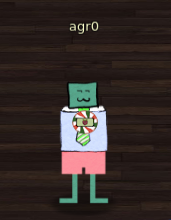

# SANS Holiday Hack Challenge, 2019

Hello. This is my second Holiday Hack Challenge, but the first writeup I've
ever done for one. Please bear with me.

# Story
Elf University has been hacked! Follow me as I do my best to write up the
incident, report on how I was able to accomplish everything, and ultimately
test my mettle with various Red Team/Blue Team tactics. Thanks as always to
@Edskoudis for an awesome Holiday Hack Challenge!

# Starring: Me

# Terminal Challenges

- [Nyanshell](terminal/nyancat.md)
- [Powershell Challenge](terminal/powershell.md)
- [Linux Path Challenge](terminal/linuxpath.md)
- [Challenge with MongoDB](terminal/mongodb.md)
- [Door code](terminal/doorcode.md)
- [Graylog](terminal/graylog.md)
- [Web Apps: A TrailHead -- Holiday Hack Trail](terminal/trailhead.md)

# Challenges

- [Find the Turtledoves](challenges/turtledoves.md)
- [Windows Log Analysis: Evaluate Attack outcome](challenges/obj3.md)
- [Unredact Threatening Document](challenges/unredact.md)
- [Windows Log Analysis: Evaluate Attack Outcome](challenges/wlaeval.md)
- [Windows Log Analysis: Determine Attacker Technique](challenges/wladetermine.md)
- [Network Log Analysis: From Zeek to RITA](challenges/zeekrita.md)
- [Splunk](challenges/splunk.md)
- [Access to Minty's Dorm Room](challenges/dormroom.md)
- [Who Took the Turtle Doves?](challenges/turtle.md)
- [Capteha Bypass with Machine Learning](challenges/capteha.md)
- [Retrieve Scraps of Paper from Server](challenges/scraps.md)
- [Decrypting ElfScrow](challenges/elfscrow.md)
- [Opening "The Crate"](challenges/thecrate.md)
- [Analysis with JQ](challenges/jq.md)
- [SRF Admin Portal](challenges/srf.md)
