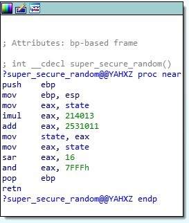
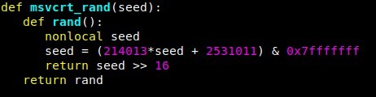
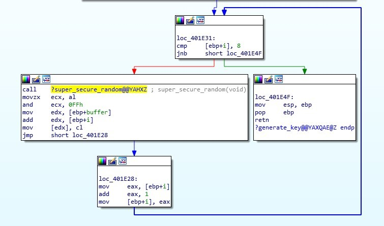
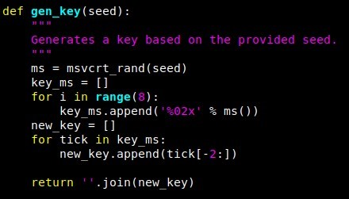

# Decrypting ElfScrow

This task involved decrypting a file that was encrypted with a weak key,
randomized by a psuedorandom number generator. First thing is first,
opening elfscrow.exe in IDA while loading up the symbol table (which is
admittedly a tremendous help). My goal now was to find out how the key
was generated. Let's dive into that!
	
First of all, I looked for the function generate_key(), which was aptly
named. Stepping through the code and I can find a few things to search
on, specifically this section here:

This is the function that generates a "random" number. We have some
constants! I ran a google search on 2531011 and discovered that this is
simply the rand() function on a Windows platform!
	
Rosetta code gave me the python equivalent, which I kept for later use:

I noticed that it runs this function 8 times in sequence, as evidenced
from this loop (notice the bottom box adding 1 to EAX, then the top box
comparing EBP+i to the number 8).

This is actually very telling! The key is 8 bytes long! That means that
the encryption algorithm is most likely DES! DES typically has an 8 byte
key while AES has at least a 16 byte string, potentially larger by a
factor of 8.
	
Okay. So let's go into what we know that the program does by simply
running it as intended. Here are my notes for that:
	
When encrypting a file, elfscrow.exe will perform the following:
		
- Posts a Seed to STDOUT
- Posts an encryption key (that it generates from the seed) to STDOUT
- Makes an API call with the server to: https://elfscrow.elfu.org/api/store with the encryption key
- Server responds with a unique identifier.
- Program posts the unique identifier as a secret ID that you shouldn't share with anyone.

Conversely, if you are decrypting, elfscrow.exe will perform the following
- It will require that you post the ID to the command line. It then uses this ID to retrieve the encryption key which it will use to decrypt the file.
- Posts the ID to https://elfscrow.elfu.org/api/retrieve with the UUID
- Server responds with encryption key
- Program attempts to use encryption key on file

**Deep-dive into the binary, it looks as if the seed isn't really randomly generated. It's the output of the time() function, which just prints epoch time!**
	
Funnily enough, we also have the date and time of when this file was
encrypted! I'm thinking a brute-force method is in order to find a
valid key, considering I have a window of 2 hours to generate keys and
attempt to brute force this algorithm.
		
Additional manipulation of the program as it is intended to be used
shows that the encrypted data will change the entire cipher if the first
character is changed. This means that we are not dealing with ECB
encoding, but rather CBC.
		
Some playing with the function and I eventually come up with the following
function to generate a valid key based on the epoch time. This will
generate a valid key every time!

I don't know why I used the variable "tick." Okay, so let's go over what we
know so far! I know the date and time the file was supposedly generated from
the challenge text (on December 6th, 2019 between 7pm and 9pm UTC, aka
1575658800 to 1575666000). I know the algorithm that is used, and I can
generate a key based on the epoch time. This key can be used to decrypt a
file. So now all I have to do is write a script that will attempt to decrypt
the file over and over again and then run a check on it to determine if the
file is valid or not. I'll simply use the linux command "file" to run a
bytewise check on the data and determine if it's a PDF doc.
		
I wrote a script which did just that. It's hacky, it's crazy, but best of all
it WORKED!

Source code available [here](decr.py).
