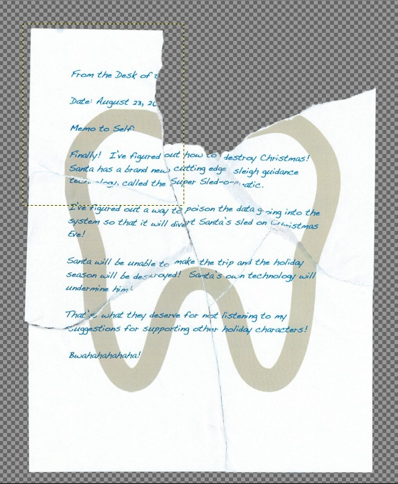

# Retrieve Scraps of Paper from Server

This exercise is that of an offensive attack. By siding with Krampus, he claims that
he has information that is locked behind an account that he no longer has access to.
He is asking me if I can break in and obtain the information behind the website.
	
The website in question (https://studentportal.elfu.org) contains some information
about the student body, as well as the ability to apply to become a student as well
as check your application status. Both of these pages are user-input fields, and
both of them are susceptible to a SQL injection attack. This is determined by
putting a ' character in any of the fields and seeing what returns. In both cases I
am able to obtain a SQL error, although with the application status checker page it
performs some client-side data validation to ensure that what you're entering is an
email address. Even still I can turn off javascript and view the error.
	
To establish a proof of concept, I fired up Burp Suite and intercepted the request,
only to find out that it makes a GET request prior to a POST request. The GET request
simply obtains a token from the server and appends it to the end of the POST request.
This token has a short-lived expiration date, so I can't simply obtain a token and
use it over and over again.
	
This unfortunately will defeat a "vanilla" run of sqlmap, considering sqlmap is not
inherently aware of CSRF tokens without some proper coaxing. To get around this, I
first needed to establish a proof of concept, so I began coding a SQL injection
attempt in python. What I needed to do was:

1. Make a GET request to the server to obtain a token
2. Make a POST request with the token appended to the URL Parameters
3. Find an injection point.

Number 1 and 2 were taken care of, just a couple lines of python. Eventually I found
the injection point between the email address, and "' OR '1'='1".
	
Now the problem is this is a blind SQL injection attack, so unless I want to code my
own, my best bet is to not re-invent the wheel and simply use sqlmap. Unfortunately
sqlmap doesn't have any built-in means of dealing with token collection. That means
I'll have to create my own tamper script! It's basically a plugin for sqlmap that
allows you to manipulate the payload before sending it.

I coded up the following to help with this:
```python
		#!/usr/bin/env python3
		"""
			A tamper script
		"""
		from lib.core.data import kb
		from lib.core.enums import PRIORITY
		import requests
		import urllib
		__priority__ = PRIORITY.NORMAL
		
		token_url = "https://studentportal.elfu.org/validator.php"
		
		def dependencies():
		    pass
		
		def tamper(payload, **kwargs):
		    token_get = requests.get(token_url)
		    retval = urllib.parse.quote(payload) + f"&token={token_get.text}"
		    # print(f"Tampered payload: {retval}")
        return retval
```
You'll see that I first obtain the token from validator.php and quickly append it
to the payload. In order for this to work in any capacity, sqlmap MUST be
configured to NOT url encode this payload at all! Something it does by default. To
that end, the user must trust that the tamper script will do the proper URL encoding,
and as you can see I do.
	
To run this, the command was:
	
	`client~# sqlmap -u 'https://studentportal.elfu.org/check-application.php?elfmail=a' --no-urlencode --tamper elf_tamper.py --dump`
	
This allowed me to dump the entire database! I only needed krampus's table, so inside
that was a link to several JPG's. Each jpg was a torn piece of paper. Taking the
pieces of paper and arranging them formed:



Nice! Weird icon though...is that a tooth?
