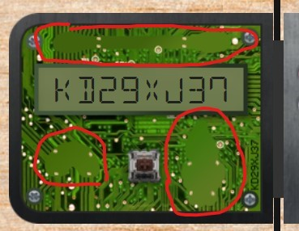

# Opening "The Crate"

The crate was a challenge that involved looking into the deepest
depths of your browser to find the keys to open the crate. There
were ten locks and each one had a particular hint as to where to
find the code. The codes were randomly generated at page-load
time, so if you reloaded your browser you would need to re-do
them all over again. Here are the answers to obtaining the codes.
Meaning: You can't just enter these codes directly from here to
your challenge as they are.

## Lock 1: "You don't need a clever riddle to open the console and scroll a little."

This was obtained by opening the browser's java console:

## Lock 2: "Some codes are hard to spy, perhaps they'll show up on pulp with dye?"

This code was obtained by printing the page. At the print preview
the code was visible:

## Lock 3: "This code is still unknown; it was fetched but never shown."

This was obtained by opening up the network tab in your Developer Tools dialog and
mousing over the downloaded image requests. One which wasn't actually loaded and
visible on the page will pop up:

## Lock 4: "Where might we keep the things we forage? Yes of course: Local barrels!"

This lock is a reference to the local storage container under the "storage" tab
in the developer tools. Specifically under "Local Storage."

## Lock 5: "Did you notice the code in the title? It may very well prove vital."

This code is hiding in the title of the page, padded exessively so as not to appear
unless you mouse over the tab:

## Lock 6: "In order for this hologram to be effective, it may be necessary to increase your perspective."

This was where it started to get tricky. Now you have to edit the actual CSS that
loads the page to reveal the code. The hologram in question looked like this:

The trick here is to use the hint to find the section of the CSS that deals with
perspective. Opening up the developer tools and clicking on the "Style Editor" tab
allows me to view the 4 CSS files that are loaded for the page. I chose the one
with 62 rules (the main CSS file) and did a CTRL-F and looked for the "perspective"
value.
		
Found it!

That oughta do it.

Bingo!

## Lock 7: "The font you're seeing is pretty slock, but this lock's code was my first pick."

This is straightforward. Generally if a browser is presented with multiple fonts,
it will choose the first one and attempt to load it. If it fails, it moves down the
list of provided fonts until it finds one that succeeds, and if none succeed it
chooses the system default. I just needed to find the "first font" that the browser
attempted to load. This is accomplished by checking the Style Editor again and
looking for the CSS file that attempts to load the fonts. For this, it was in the
4th CSS file loaded:

## Lock 8: "In the event that the eggs go bad, you must figure out who will be sad."

This is a weird one, especially since the word "eggs" is colored differently than
the rest of the text. This is a job for the visual inspector. I opened up the
Developer Tools and chose the selector button which would zoom in on any element on
the page and open just that section in the inspector. I moused over the word to
prove that it's its own element:

Then looked at the event in the developer console:

And noticed there's an event associated with it. Clicking on that reveals...

...who will be sad!

## Lock 9: "This code will be unredacted, but only when all the chakras are :active"

This code has to do with CSS modification, specifically when forcing a pseudo-active
state to each span class (which reveals the code), but because there was no
obfuscation the lock could be obtained by simply reading the source from top to bottom:

## Lock 10: "Oh no! This lock's out of commission! Pop off the cover and locate what's missing."

Buckle up, this one's a challenge that took me most of the night to figure out.
It involved many steps and wasn't as straightforward as the last few. It's also
going to need a bunch of screenshots to really explain what's going on, so I'll
go in steps.
		
First, this is the lock.

"Popping off the cover" so to speak is possible because the cover itself is a
layer on top of the layer beneath it. Selecting the cover is as simple as
turning on the selector and clicking on it to go to the applicable code:

Editing the above, or rather dragging and dropping the 
 with the "cover"
class to somewhere else reveals the layer underneath, which is the PCB:

You can see there in the bottom right in REAAAALLY tiny letters is the code!
Simple as that, right? So upon entering the code into this lock and clicking
on the switch (which is a cherry MX brown, BTW) reveals...nothing. Bupkis. So
I tried many things, such as popping the cover back on and pressing the
button, still nothing. Not even registering that I even clicked it, really.
So what's going on here?
		
Opening my web console gave me some indication of what was going on though...

Uhhh...what? "Missing macaroni"? This is not entirely a typical error code.
This however got me to start deep diving into the code. Does the word
macaroni come up somewhere?
		
Sure enough, yes. It comes up in the source code as…a div with a macaroni
class?

Ok...time to inspect that class.

This is just getting weird. These are components pointing to images. A
picture of a macaroni, a Q-Tip, and a garden gnome or something:

A very weirdly-justified piece of macaroni.

An also weirdly-justified Q-tip.

And a garden gnome.
		
So I scratched my head for the better part of the night trying to figure
out exactly what the correlation to these 3 images are. They seem entirely
random. Eventually I take a final look at the PCB from earlier, but just
a bit closer...

Look! The shapes with contact points of the 3 images from above! So am I
supposed to move the divs on top of this layer before clicking the button?
		
I found the correspending div tags, dragged them down to the PCB like so:

and clicked the button….
		
And I'm in! The evil villain behind this dastardly plan is none other than
the Tooth Fairy!
