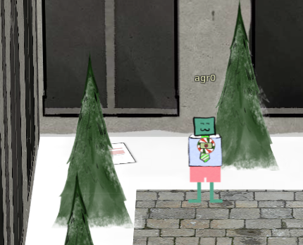
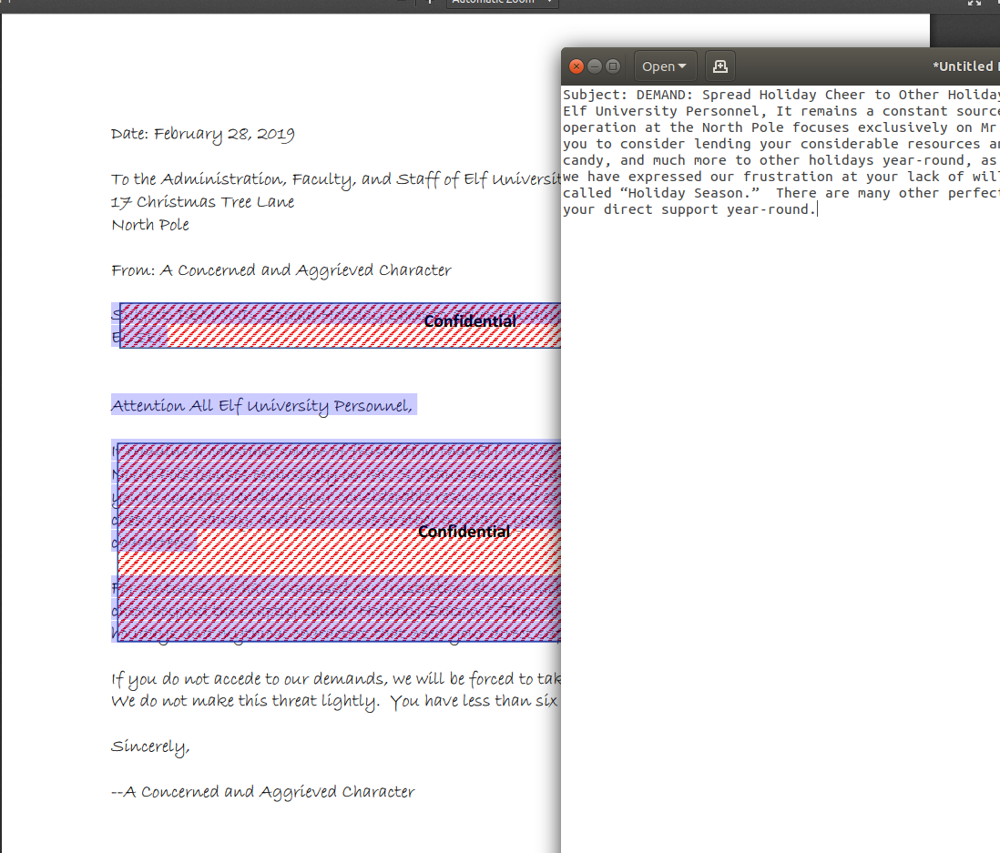

# Unredact Threatening Document

The concept of "Un-redacting" the threatening document was as
simple as copying it and pasting it elsewhere.  

The letter can be found here:

And to copy-paste it, select it, copy it and paste into something
like gedit or notepad:

The contents of the note was as follows:

> Subject: DEMAND: Spread Holiday Cheer to Other Holidays and Mythical Characters... OR ELSE! Attention All Elf University Personnel, It remains a constant source of frustration that Elf University and the entire operation at the North Pole focuses exclusively on Mr. S. Claus and his year-end holiday spree.  We URGE you to consider lending your considerable resources and expertise in providing merriment, cheer, toys, candy, and much more to other holidays year-round, as well as to other mythical characters. For centuries, we have expressed our frustration at your lack of willingness to spread your cheer beyond the inaptly-called “Holiday Season.”  There are many other perfectly fine holidays and mythical characters that need your direct support year-round.
