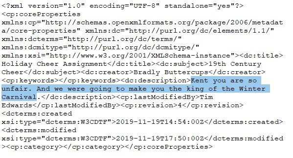

# Splunk

This is an incident response exercise. Professor Banas was hacked and the
attackers left a message mocking him. The challenge is to find the message
that the attackers wrote. 

##Question 1 

The first answer is "sweetums," as that is the computer that Professor Banas
uses, which was determined from reading the #ELFU SOC chat.  

##Question 2 

The next question was asking for the fully qualified location of the file
that was accessed, in this case: `C:\Users\cbanas\Documents\Naughty_and_Nice_2019_draft.txt`

This was determined by searching for "sweetums santa" considering the chat
asked me to look for correlations between the hostname and the conversations
with "the big guy."  

##Question 3 

This question asked for the FQDN of the C2 server controlling sweetums. With
the search string of: `sourcetype="XmlWinEventLog:Microsoft-Windows-Sysmon/Operational" EventCode=3 powershell`

I was able to determine by looking at the "Interesting Fields" specifically
under the "Destination Hostname" field. 

##Question 4 

This question requests the document that launched the malicious powershell code.
In order to find this, we must first determine the period of time the activities
occurred and pivot around that point in time to determine the parent process of
the powershell script. First, we search all powershell commands with this search: 

`index=main sourcetype="WinEventLog:Microsoft-Windows-Powershell/Operational"`

Then reverse the commands by adding a "| reverse" to the end of the above. 

From there, we click on the time property of the first showing event and choose
to search for all events + or - 5 seconds, then remove the sourcetype and
|reverse section to show all events within that 10 second window. 

From here, we see some "interesting" powershell commands, but we also care about
the process ID's that are called from here. The two process IDs that appear from
the included Sysmon events are integers, so I make a note of these: 

```
6268
5864
``` 

Now I need to search through the WinEventLogs for Windows Process Execution Events
(aka EventCode=4688) and also include the above Process IDs. But since they are in
hex, we have to convert them. I do it in splunk using the following pipe command:
`| eval convertProcId=tonumber(New_Process_ID,16)` and then simply narrow down the
resulting evaluated variable to only include the processes above, making the full
query: 

`sourcetype=WinEventLog EventCode=4688 | eval convertProcId=tonumber(New_Process_ID,16) | where (convertProcId=6268 OR convertProcId=5864)`

The query returns two results, one being the powershell script in question, and the
other being the WinWord.exe process opening the malicious file: `C:\Windows\Temp\Temp1_Buttercups_HOL404_assignment (002).zip\19th Century Holiday Cheer Assignment.docm`

##Question 5 

To obtain the amount of emails sent, some Splunk-Fu needed to be invoked. Using
the data pulled from StoQ, I crafted the following query: 

`index=main sourcetype=stoq "holiday cheer assignment" AND NOT results{}.workers.smtp.from="*carl.banas@faculty.elfu.org*" | stats count`

And the result was 21. 

###BONUS: 

Noticed a message from a supposed "student" named "Bradly Buttercups" sending
Professor Banas a word document that was zipped with a password of 123456789 and
instructing the professor to enable editing and enabling content. This is extremely
suspicious as I suspect Bradley Buttercups sending the professor a payload attached
as a word macro. 

##Question 6 

The password was gained from the email I mentioned in the previous question around
the bonus. This password was 123456789. 

##Question 7 

This was also gleaned from the previous question. A keen eye however noticed the
usage of the misspelled email address that the attacker typo-squatted (or whatever
the word is). The email is: 

`Bradly.Buttercups@eIfu.org`

That's I as in AEIOU, not L. Not easy to detect immediately. 

##Challenge Question 

The answer to the challenge question is: 

> Kent you are so unfair. And we were going to make you the king of the Winter Carnival. 

Using the following splunk query: 

`index=main sourcetype=stoq  "results{}.workers.smtp.from"="bradly buttercups <bradly.buttercups@eifu.org>" | eval results = spath(_raw, "results{}")| mvexpand results| eval path=spath(results, "archivers.filedir.path"), filename=spath(results, "payload_meta.extra_data.filename"), fullpath=path."/".filename | search fullpath!="" | table filename,fullpath`

I was able to determine the path of the extracted archive. In core.xml I was able to
find the offending statement to Kent.


