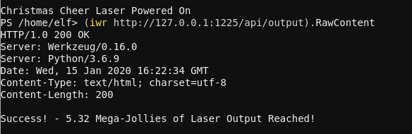

# Powershell Challenge

This challenge was a series of powershell commands to find
the appropriate settings to align a laser, which was powered
by commands sent to a REST API. You were first greeted with
the following:

> Elf University Student Research Terminal - Christmas Cheer Laser Project
> ------------------------------------------------------------------------------
> The research department at Elf University is currently working on a top-secret
> Laser which shoots laser beams of Christmas cheer at a range of hundreds of
> miles. The student research team was successfully able to tweak the laser to
> JUST the right settings to achieve 5 Mega-Jollies per liter of laser output.
> Unfortunately, someone broke into the research terminal, changed the laser
> settings through the Web API and left a note behind at /home/callingcard.txt.
> Read the calling card and follow the clues to find the correct laser Settings.
> Apply these correct settings to the laser using it's Web API to achieve laser
> output of 5 Mega-Jollies per liter.
> 
> Use (Invoke-WebRequest -Uri http://localhost:1225/).RawContent for more info.

This challenge was a scavenger hunt. Your mission, should you
choose to accept it, is to find all of the configuration settings
you need to align the laser and obtain over 5 Mega-Jollies of
laser output.

First step was to get the recent history:

`Get-History`

This will print the current history, and in there you can find the following

```
  Id CommandLine
  -- -----------
   1 Get-Help -Name Get-Process
   2 Get-Help -Name Get-*
   3 Set-ExecutionPolicy Unrestricted
   4 Get-Service | ConvertTo-HTML -Property Name, Status > C:\services.htm
   5 Get-Service | Export-CSV c:\service.csv
   6 Get-Service | Select-Object Name, Status | Export-CSV c:\service.csv
   7 (Invoke-WebRequest http://127.0.0.1:1225/api/angle?val=65.5).RawContent
   8 Get-EventLog -Log "Application"
   9 I have many name=value variables that I share to applications system wide. At a com…
```
First of all, hey we got the angle value:

`(Invoke-WebRequest http://127.0.0.1:1225/api/angle?val=65.5).RawContent`

To expand on the 9th item on that list, we can use this:

`Get-History | select-string name=value`

and it returns:

> I have many name=value variables that I share to applications system wide. At a command I will reveal my secrets once you Get my Child Items.

So I printed all environment variables:

`Get-ChildItem env:`

And it printed:

```
Name                           Value
----                           -----
_                              /bin/su
DOTNET_SYSTEM_GLOBALIZATION_I… false
HOME                           /home/elf
HOSTNAME                       db80e36d8b3a
LANG                           en_US.UTF-8
LC_ALL                         en_US.UTF-8
LOGNAME                        elf
MAIL                           /var/mail/elf
PATH                           /opt/microsoft/powershell/6:/usr/local/sbin:/usr/local/bi…
PSModuleAnalysisCachePath      /var/cache/microsoft/powershell/PSModuleAnalysisCache/Mod…
PSModulePath                   /home/elf/.local/share/powershell/Modules:/usr/local/shar…
PWD                            /home/elf
RESOURCE_ID                    182badf7-921d-4def-a04d-06092bbbe69e
riddle                         Squeezed and compressed I am hidden away. Expand me from …
SHELL                          /home/elf/elf
SHLVL                          1
TERM                           xterm
USER                           elf
userdomain                     laserterminal
USERDOMAIN                     laserterminal
username                       elf
USERNAME                       elf
```

So there's that riddle variable in my environment. I can print that out like so:

`Write-Output $env:riddle`

Which returned:

> Squeezed and compressed I am hidden away. Expand me from my prison and I will show you the way. Recurse through all /etc and Sort on my LastWriteTime to reveal I'm the newest of all.

Pretty straightforward:

`Get-ChildItem -Recurse -Path /etc | sort-object LastWriteTime`

And it printed a ton of output, but on the bottom it showed
the file: /etc/apt/archive. I assumed this is a compressed
file from the above hint, so I expanded the archive by first
trying to find the command:

`Get-Command | select-string archive`

Which returned two things I can do:

```
Compress-Archive
Expand-Archive
```

So there we go -- I can expand it like so:

`Expand-Archive /etc/apt/archive`

It created a new directory called "archive" in /home/elf. Inside
`/home/elf/archive/refraction/` was a file "runme.elf". Cute. First,
I had to chmod it to execute:

`chmod +x ./runme.elf`

Then start it

`Start-Process ./runme.elf`

It returned:

> refraction?val=1.867

Cool, got the refraction value. Two down so far.

Inside /home/elf/archive/refraction/riddle there was the text:

> Very shallow am I in the depths of your elf home. You can find my entity by using my md5 identity:
>
> 25520151A320B5B0D21561F92C8F6224

So to find the file in question, I created the following:

`Get-ChildItem -Recurse -Path /home/elf -include *.txt | ForEach-Object { $x = Get-FileHash -Algorithm MD5 $_.fullname ; if ($x.Hash -eq "25520151A320B5B0D21561F92C8F6224") { Write-Output "We got one! := $($x.Path)" } }`

And it returned:

> `We got one! := /home/elf/depths/produce/thhy5hll.txt`

The contents of that file:

> temperature?val=-33.5
>
> I am one of many thousand similar txt's contained within the deepest of /home/elf/depths. Finding me will give you the most strength but doing so will require Piping all the FullName's to Sort Length.

Alright, we have 3 now.

New challenge, now find the longest fullname in the depths directory.

I ran:

`Get-ChildItem . -Recurse | Select-Object fullname | Sort-Object {$_.Fullname.Length } | ForEach-Object { $x = $_.fullname }
Write-Host $x`

And $x contained the value:

> /home/elf/depths/larger/cloud/behavior/beauty/enemy/produce/age/chair/unknown/escape/vote/long/writer/behind/ahead/thin/occasionally/explore/tape/wherever/practical/therefore/cool/plate/ice/play/truth/potatoes/beauty/fourth/careful/dawn/adult/either/burn/end/accurate/rubbed/cake/main/she/threw/eager/trip/to/soon/think/fall/is/greatest/become/accident/labor/sail/dropped/fox/0jhj5xz6.txt

It contained the contents:

> Get process information to include Username identification. Stop Process to show me you're skilled and in this order they must be killed:
>
> bushy
> alabaster
> minty
> holly
> 
> Do this for me and then you /shall/see .

Ok then. I ran the following to get the associated users:

`Get-Process -IncludeUserName`

Then killed them in this sequence:

```
Stop-Process -Id 39
Stop-Process -Id 10
Stop-Process -Id 64
Stop-Process -Id 72
```

And then printed the contents of /shall/see:

`Get-Content /shall/see`

> Get the .xml children of /etc - an event log to be found. Group all .Id's and the last thing will be in the Properties of the lonely unique event Id.


Alright! So:

`PS > Get-ChildItem -Path /etc -Include *.xml -Recurse`

And it returns:

> /etc/systemd/system/timers.target.wants/EventLog.xml
>  Get-Content /etc/systemd/system/timers.target.wants/EventLog.xml

I created an xml var:

`[xml]$xml = Get-Content /etc/systemd/system/timers.target.wants/EventLog.xml`

Then I grouped it based on ID's:

`$grouped = $xml.Objs.Obj.Props | Group I32`

...

After a lot of research, I discovered a much better way!

`$myEvents = Import-CliXml -Path /etc/systemd/system/timers.target.wants/EventLog.xml`

And then grouped it by Id to determine one single standout

`$myEvents | Group Id`

It returned:

```
Count Name Group

----- ---- -----

1   1 {System.Diagnostics.Eventing.Reader.EventLogRecord}

39  2 {System.Diagnostics.Eventing.Reader.EventLogRecord, System.D…

179 3 {System.Diagnostics.Eventing.Reader.EventLogRecord, System.D…

2   4 {System.Diagnostics.Eventing.Reader.EventLogRecord, System.D…

905 5 {System.Diagnostics.Eventing.Reader.EventLogRecord, System.D…

98  6 {System.Diagnostics.Eventing.Reader.EventLogRecord, System.D…
```

There's one entry with the ID of 1! So….

`$myEvents | where-object {if ($_.Id -eq 1) { Write-Output $_ }}`

Which printed out a lot of output, but one line in particular stuck
out...

> C:\Windows\System32\WindowsPowerShell\v1.0\powershell.exe -c "$correct_gases_postbody = @{O=6;H=7;He=3;N=4;Ne=22;Ar=11;Xe=10;F=20;Kr=8;Rn=9;}"

So:

@{O=6;H=7;He=3;N=4;Ne=22;Ar=11;Xe=10;F=20;Kr=8;Rn=9}

Jackpot!

So we've got everything we need!

```powershell
(iwr http://127.0.0.1:1225/api/angle?val=65.5).RawContent
(iwr http://127.0.0.1:1225/api/temperature?val=-33.5).RawContent
(iwr http://127.0.0.1:1225/api/refraction?val=1.867).RawContent
$postParams = @{O=6;H=7;He=3;N=4;Ne=22;Ar=11;Xe=10;F=20;Kr=8;Rn=9}
(iwr http://127.0.0.1:1225/api/gas -Method POST -Body $postParams).RawContent
(iwr http://127.0.0.1:1225/api/on).RawContent)
(iwr http://127.0.0.1:1225/api/output).RawContent
```

Got it!


